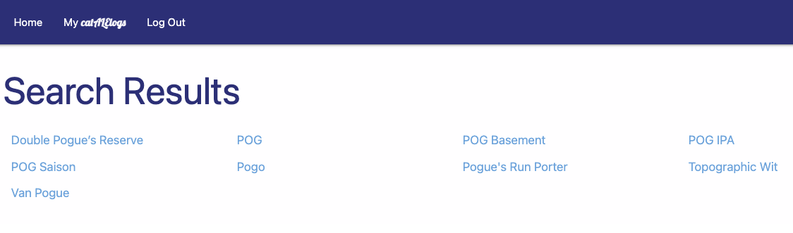

```

           _     _      __    __ _                 
  ___ __ _| |_  /_\    / /   /__\ | ___   __ _ ___ 
 / __/ _` | __|//_\\  / /   /_\ | |/ _ \ / _` / __|
| (_| (_| | |_/  _  \/ /___//__ | | (_) | (_| \__ \
 \___\__,_|\__\_/ \_/\____/\__/ |_|\___/ \__, |___/
                                         |___/     

```

# Catalog your Beer with cat ALE logs

## Description
Search a databse of over 60,000 beers and mix and match them on your personal beer "playlists".
View brewery, style, ABV%, and IBU rating for each beer.

## Screenshots
### cat ALE log List

### cat ALE log Details

### Search Results

### Beer Details


## Technologies Used
- HTML
    - Pages rendered via ejs.
- CSS
    - Materialize CSS library
- MEN Stack
    - MongoDB database
    - Mongoose ODM
    - Express web framework
    - Node.js
- APIs
    - catalog.beer API

## Getting Started
- Deployed Application
    - https://catalelogs.fly.dev/
- Trello Planning Board
    - https://trello.com/b/Ctuq0zID/sei-project-two


## Next Steps
    - Add loading wheel during API fetch to enhance user experience.
    - Add functionality to view other users' cat ALE logs in addition to your own.
    - Add delete button on cat ALE log beer detial page so it doesn't have to be deleted from the index view.
    - Add field for user comments.
    - Add option for user rating.
